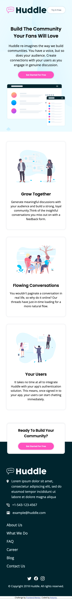
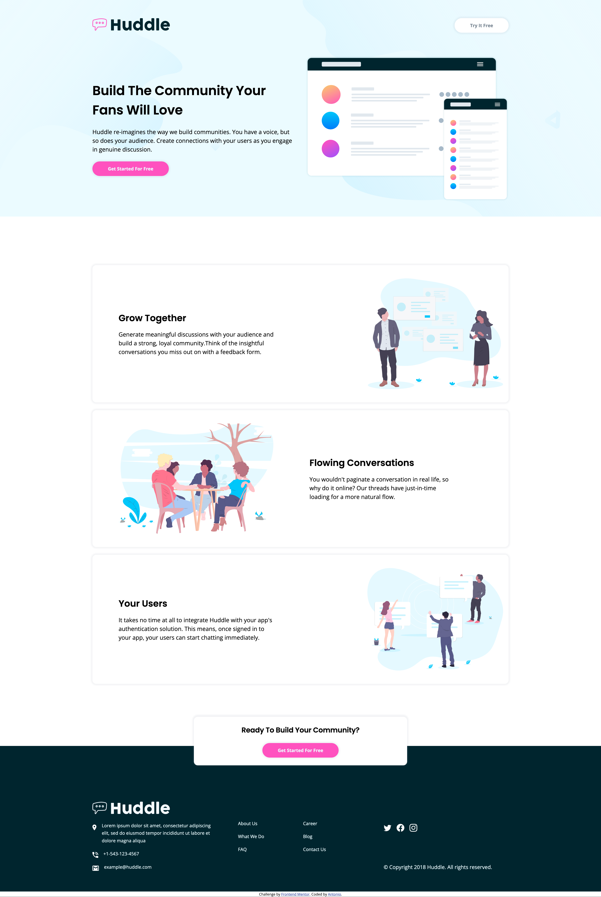

# Frontend Mentor - Huddle landing page with alternating feature blocks solution

This is a solution to the [Huddle landing page with alternating feature blocks challenge on Frontend Mentor](https://www.frontendmentor.io/challenges/huddle-landing-page-with-alternating-feature-blocks-5ca5f5981e82137ec91a5100). Frontend Mentor challenges help you improve your coding skills by building realistic projects. 

## Table of contents

- [Overview](#overview)
  - [The challenge](#the-challenge)
  - [Screenshot](#screenshot)
  - [Links](#links)
- [My process](#my-process)
  - [Built with](#built-with)
  - [What I learned](#what-i-learned)
  - [Continued development](#continued-development)
  - [Useful resources](#useful-resources)
- [Author](#author)
- [Acknowledgments](#acknowledgments)

**Note: Delete this note and update the table of contents based on what sections you keep.**

## Overview

### The challenge

Users should be able to:

- View the optimal layout for the site depending on their device's screen size
- See hover states for all interactive elements on the page

### Screenshot




### Links

- Solution URL: [Click here](https://github.com/Antonio0402/huddle-landing-page-with-styled-components)
- Live Site URL: [Click here](https://huddle-landing-page-styled-components.netlify.app)

## My process

### Built with

- Semantic HTML5 markup
- Flexbox
- CSS Grid
- Mobile-first workflow
- [React](https://reactjs.org/) - JS library
- [Styled Components](https://styled-components.com/) - For styles


### What I learned

- Building a webpage from scratch using React JS and styling seperated components with Styled Components;
- How to use ThemeProvider to generate utility objects to handle or modify the theme colors and other dimensions.

Using Custom objects from Theme Provider and passing as props, see below:

```js
  background-color: ${({theme}) => theme.colors['grayish-blue']};
  border: 1px solid ${({theme}) => theme.colors['grayish-blue']};
```
```js
const theme = {
  colors: {
    primary: 'hsl(322, 100%, 66%)',
    dark: 'hsl(192, 100%, 9%)',
    light: 'hsl(193, 100%, 96%)',
    'grayish-blue': 'hsl(208, 11%, 55%)',
  },
  text: {
    900: '2.5rem', /* 40px tracking tight*/
    '900-sm': '1.75rem',
    800: '2rem', /* 32px tracking tightest*/
    '800-sm': '1.375rem', /* 22px tracking tighter*/
    700: '1.75rem', /* 28px */
    '700-sm': '1.5rem', /* 24px */
    600: '1.125rem', /* 18px */
    'body-hero': '1.1875rem', /*600-sm 19px tracking wide */
    'body': '1.0625rem', /* 17px */
    500: '0.875rem', /* 14px */
    'btn-sm': '0.9375', /* 15px tracking tightest */
    400: '0.875rem', /* 14px */
    '400-sm': '1.1875rem', /* 19px tracking wide */
    'link-sm': '1.375rem', /* 22px */
  },
  tracking: {
    tightest: '-0.015em',
    tighter: '-0.01em',
    tight: '-0.005em',
    normal: '0em',
    wide: '0.005em',
    wider: '0.03em',
    widest: '0.05em',
  },
  fonts: {
    body: "'Open Sans', sans-serif",
    heading: "'Poppins', sans-serif",
  },
  shadow: {
    btn: '0 0 4px 4px hsla(208, 11%, 55%, 0.1)',
    cta: '0 0 4px 4px hsla(322, 100%, 66%, 0.5)'
  }
}
```

### Continued development

- I am going to keep trying to have a good grasp of using Bootstrap 5 class in advanced projects. 
- Fully comprehend the React library 's functions by building dynamic data fetching components in the future projects.


### Useful resources

- [Styled components - Documents](https://styled-components.com/docs)
- [Styled Components Crash Course & Project](https://www.youtube.com/watch?v=02zO0hZmwnw)

## Author

- Frontend Mentor - [@Antonio0402](https://www.frontendmentor.io/profile/Antonio0402)

## Acknowledgments

So much thanks specially to Traversy Media Youtube Chanel for helping me get through this project as well as simplified the concepts of usage in real projects.
